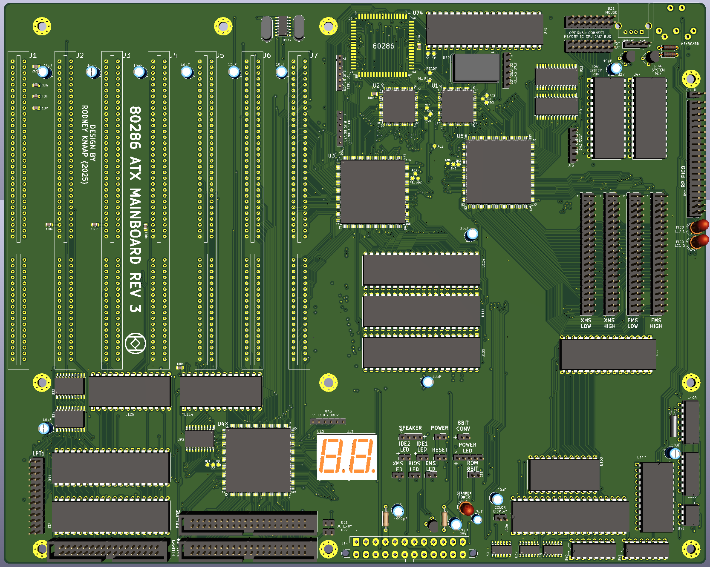
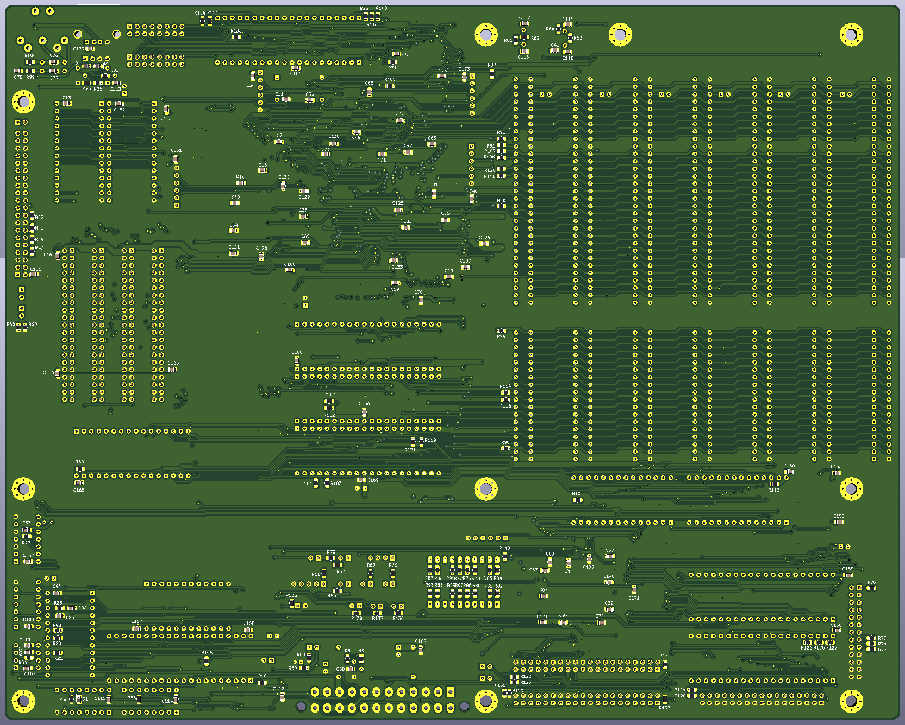
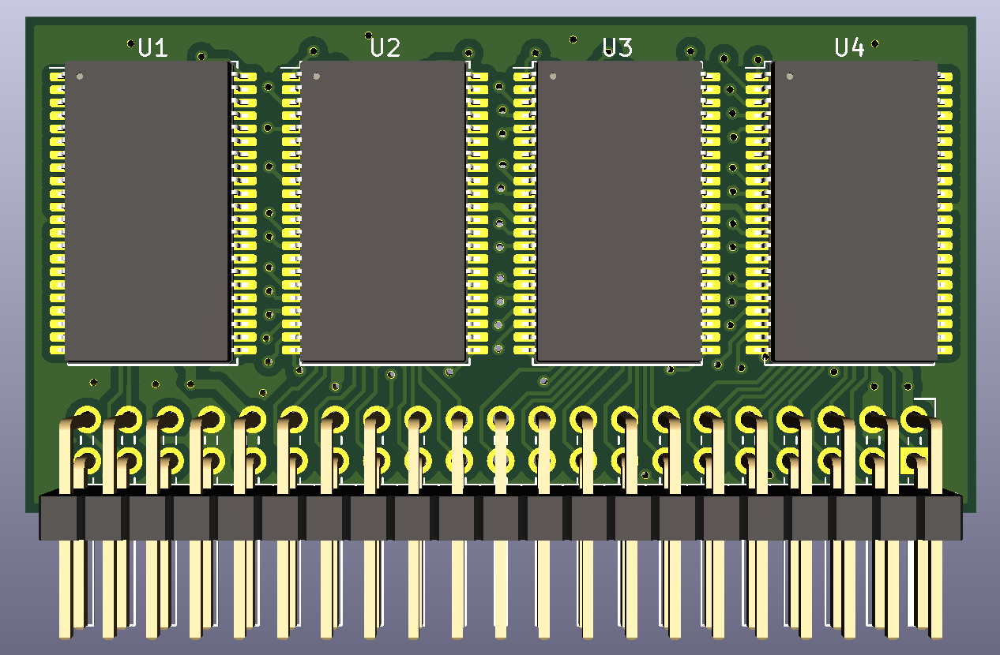
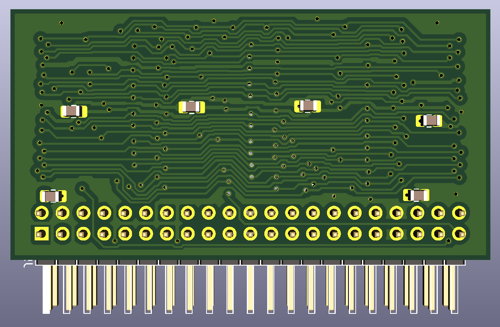
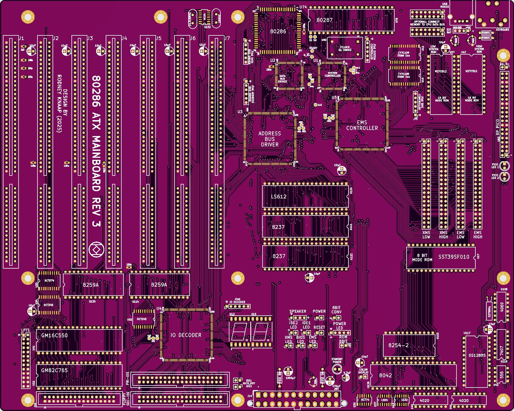
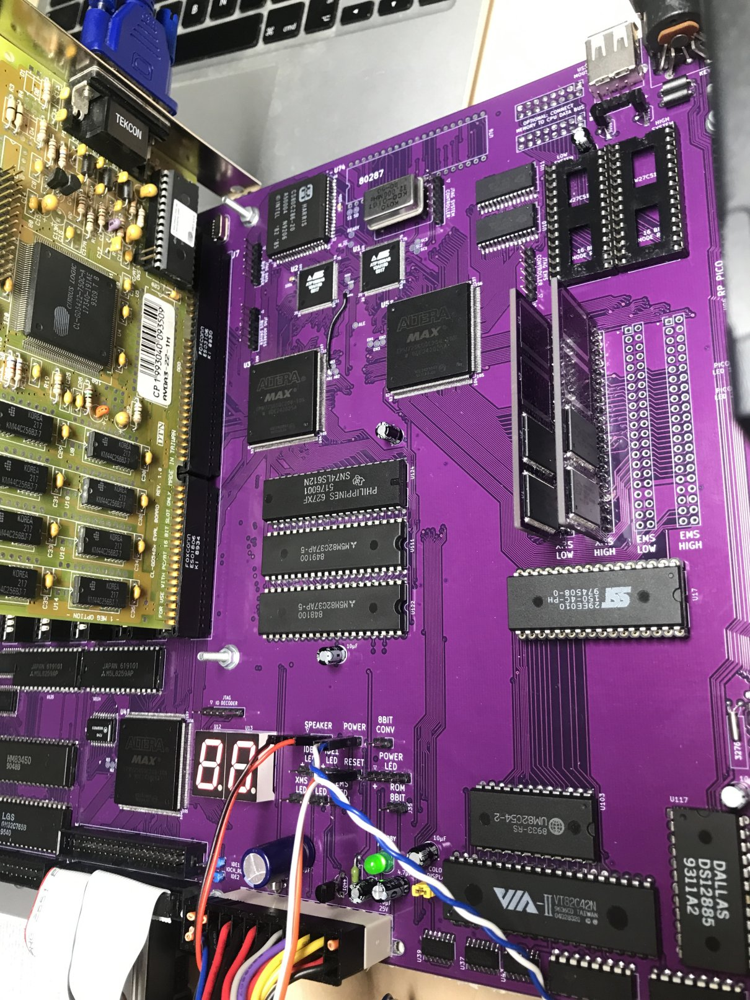
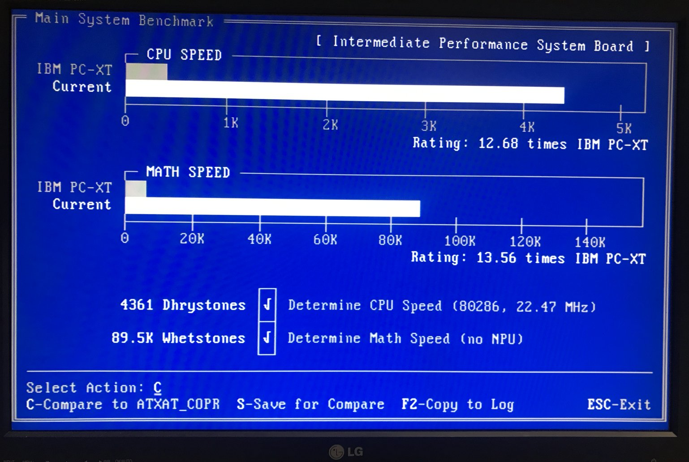

# ATX-286AT-V3-mainboard  
## 286 PC/AT CPLD ATX mainboard revision 3  
This project is Revision 3 of my open source 286 AT ATX PC mainboard design using CPLD technology.
As with the first revision, the design is based on the original IBM 5170 PC/AT concept.

The project consists of an ATX mainboard and a SRAM module design, there are 2 SRAM modules used for XMS and 2 for EMS memory. EMS is optional but recommended.
SRAM ICs can be added as a set to each low and high byte module which will result in 2MB of SRAM per set of a high byte and low byte SRAM chip.
For example, using only two of the SRAM chips you can have a PC with 2MB of RAM. Using 4, you get 4MB and so on.

The mainboard supports the 80286 16 bit CPU, bus driving is now completely done by CPLD logic.
A Harris 286 rated at 20MHz is recommended, certain older manufacturing dated chips are able to run at much higher clock speeds in other systems.
Basically for composing the core PC/AT system based on IBM 5170 technology all logic is now contained within 5 CPLD ICs.
A few TTL chips are added for the printer port and slow I/O bus separation from the system bus.  

  

  

  

  

## Purpose and permitted use, cautions for a potential builder of this design
This project was created for historical purposes out of love for historical computing designs and for the purpose of enabling computing enthousiasts with a sufficient level of building and troubleshooting expertise to be able to experience the technology by building and troubleshooting the hardware described in this project. Due to the level of this project, it may be suitable as a project for students to get into. If there are any questions from teachers who like to teach about this technology I would be happy to answer them. It may be really interesting to analyse the elaborate and complex CPU timing and 8 bit to 16 bit data byte translation and DMA mechanisms in an educational setting.

Besides the GPL3 license there are a few warnings and usage restrictions applicable:
No guarantees of function or fitness for any particular or useful purpose is given, building and using this design is at the sole responsibility of the builder.

Do not attempt this project unless you have the necessary electronics assembly expertise and experience, and know how to observe all electronics safety guidelines which are applicable.

It is not permitted to use the computer built from this design without the assumption of the possibility of loss of data or malfunction of the connected device. To be used strictly for personal hobby and experimental purposes only. No applications are permitted where failure of the device could result in damage or injury of any kind.

If you plan to use this design or any part of it in new designs, the acknowledgement of the designer and the design sources and inspirations, historical and modern, of all subparts contained within this design should be included and respected in your publication, to accredit the hard work, time and effort dedicated by the people before you who contributed to make your project possible.

No guarantee for any proper operation or suitability for any possible use or purpose is given, using the resulting hardware from this design is purely educational and experimental and not intended for serious applications. Loss of data is likely and to be expected when connecting any storage device or storage media to the resulting system from this design, or when configuring or operating any storage device or media with the system of this design.

When connecting this system to a computer network which contains stored information on it, it is at the sole responsibility and risk of the person making the connection, no guarantee is given against data loss or data corruption, malfunctions or failure of the whole computer network and/or any information contained inside it on other devices and media which are connected to the same network.

When building this project, the builder assumes personal responsibility for troubleshooting it and using the necessary care and expertise to make it function properly as defined by the design. You can email me with questions, but I will reply only if I have time and if I find the question to be valid. Which will probably also lead to an update here. I want to primarily dedicate my time to new project development, I am not able to do any user support, so that's why I provide the elaborate info here which will be expanded if needed.

These disclaimers and conditions may seem unfriendly but remember that they are by no means meant to reflect on you as a reader personally or individually, just imagine that all possible people and unwise use and situations still need to be covered since this project is openly published on the internet, which means any person on the planet is able to find the information, thus also the comments are meant for every possible person who wants to use the information. I am reasonably assuming that 99% of people will be civilized enough to observe respect and common sense.

# Revision 3-D design of a PC/AT mainboard based on CPLD technology  
For background information and previous acknowledgements, please first see the Rev1 design repository. 
The information provided here is purely meant to describe the differences and changes in the new REV3D design.  

After designing, building and continued development of the Revision 1 PC/AT design based on the IBM 5170, I reached a final point of development where the current heavily modified Rev1 board has served its purpose in advancing the system to the most fully featured version possible with that board configuration. In order to go further with development, my main goal for this Revision 3D is a deeper level of integration, reducing the external TTL logic, and also further integrating the bus concepts instead of joining the system bus externally using the original tri-state mechanisms.

Initially I intended to implement a much higher level of integration, where the intention is also to use much faster CPLD logic in the system, however quickly it became apparent that when using CPLDs, I only had a maximum of six possible different OE signals available per package. For implementing bus mechanisms this is a severe limitation making it impossible to create a PC/AT with only few CPLD packages. Even when using very large packages, this same limit still applied. It quickly became apparent that the mainboard could only be realized with CPLDs when using a larger number of these. Besides this, it is also hard to combine a system controller function with other functions. Another consideration was my intention to implement the entire address bus control for the CPU, DMACs and ISA slot master in a single large CPLD package. The reason for wanting this is when we don't do this, we end up with address bus mechanisms that greatly increase the trace density of the mainboard, which we definitely don't want. So I needed a few design attempts to reach a proper division of the system into several CPLD packages where the design would be even possible to realize, hence the designation 3-D where the fourth variation yielded the most promise of all ideas. Each design attempt from A to D meant partially designing the entire mainboard and creating the layout in order to get an impression of each design as a whole.  

Besides the severe limitations of only six different OE functions per package, there were some secondary issues with the quartus compiler/fitter where in the situation when a certain package was rather heavily used, let's say above 85% of macrocell logic being consumed in the CPLD package, the risk of the quartus compiler not being able to successfully compile the design increased dramatically. In order to prevent the situation where I would be developing a certain CPLD chip in the design and recompiling it, and the compilation no longer being possible, I decided to further distribute the PC/AT design into the 5 CPLD chips this mainboard uses. Particularly the System controller CPLD has been purposely kept rather low in macrocell consumption. The System controller is a logic intensive design with many registers. So this lead to the final design concept using 5 CPLDs. The 5th CPLD, the IO Decoder, has been expanded with a few functions since this package had a substantial number of free pins available. The IO Decoder now contains a 7 segment POST display driver clocking the data from port 80 of the PC/AT, it drives the port B and C for a LPT port, externally controls a few TTL chips to realize a bidirectional LPT port and contains primary and secondary standard AT compatible 16 bit IDE ports. Further, the IO decoder CPLD is dividing a few clock signals to drive the system timer and UART, and it implements a "quiet bus" principle on the FDC and UART present on the mainboard. A few transceivers and register are still used in this design for achieving secondary design goals of integration which is not possible to realize within the total number of different OE functions in the 5 CPLD packages. The external transceivers are all used for slower I/O operations only and remain inert if those devices are not being used.

Why not use an FPGA now then? This has several reasons. I have compiled a single quartus project which contained an entire PC/AT which was successful to compile in the case of using a FPGA device, however using an FPGA has several consequences which are at the moment undesirable, particularly the type of package being BGA which complicates manual soldering a lot, and the lowering of logic voltage which would once again create the necessity of bus transceivers or level shifters. In this design, I am attempting to prevent any transceivers or latches on the board. If I were not doing that, I would hardly need to change the previous REV1 design. The only reason for taking the project to a higher level would be to increase the level of integration. That's not to say that later on I will not shift to using FPGA, however I want to first attempt this design stage.

While examining a VLSI TOPCAT mainboard and further looking at other VLSI based mainboard designs, I noticed the direct attachment of the RAM memory to the CPU data bus which had been implemented for the first time in the initial 16MHz 286 designs using the 5 part VLSI chipsets with smaller pin count chips. Particilarly, I suspect that this modification of the memory connected directly to the CPU databus arose from the need to run the RAM memory at higher CPU clock speeds for faster CPU memory operations. Eliminating all transceivers from the memory data bus seems a very good way to increase the CPU memory operation speeds and probably the CPU efficiency as well.  So this change of the bus structure would also naturally be desirable for our project here. Since the PC/AT has a rather complex data bus control because of 8 <-> 16 bit data byte conversion technology, I cannot simply replicate this design feature, so I intend to look at this matter in more detail after first confirming a normal memory databus system design principle. I have created a set of jumper footprints on the mainboard where we can attach the memory databus directly to the CPU databus using 16 jumper wires. Before hand, the memory databus needs to be deactivated on the EMS controller CPLD in order to prevent bus contention. So we have a means on this mainboard design to develop the system further to hopefully enhance the maximum obtainable CPU clock rate.

The design features a normal XMS memory using two of the four SRAM memory modules, resulting in a maximum of 8MB of XMS/conventional RAM and UMB RAM, and besides this, we can have two EMS SRAM modules. XMS is also used for shadow copying the system BIOS and option ROM BIOS areas as desired. The EMS operation will be further detailed here as soon as this is under test/development. EMS memory is theoretically capable to remap any 16KB block of conventional memory, as well as the D000 and E000 "page frame" segments as well as any other area of below 1MB memory, as desired. To enhance EMS pages in the protected mode memory areas has been avoided because in protected mode we would have the XMS memory available. EMS here is used to enhance the Real mode operation of the 286 with a larger EMS memory pool. 

The System controller also contains cycle control logic which switches the 286 on a lower clock speed for speed sensitive memory and I/O operations. When these areas are detected, an alternate clock mode is implemented dynamically in specific points of the CPU clock cycles in order not to disrupt the clock cycle transitions while the CPU is executing cycles.

The Address driver/decoder CPLD in addition contains DMA specific logic in order not only to generate the system address bus from the CPU but also from the DMACs and a bus Master if present on the slot connector. The Address driver/decoder is also decoding all XMS and EMS memory in the system. For this purpose the Address driver/decoder communicates with the EMS controller in order to determine the selection of XMS or EMS memory for each area of system memory. By default, each page block of system memory is initially programmed to be a default page which is located in the XMS memory chips. When a certain block is reprogrammed in the EMS page registers, it will be remapped into any programmable block inside the EMS memory pool. By programming a memory block back to default, the original memory contents are mapped back into that 16KB page block.

# Status of the project  
Currently the project is fully prepared in the quartus CPLD programming, which have been uploaded here into this repository.  

The PCBs have been ordered from JLCPCB (3-8-2025)  

  

All schematics have been uploaded here in PDF format, which includes the mainboard as well as the quartus block design schematics. The BDF files and quartus archives are assigned with 000 initially because these are pre-testing versions.  

# Status update 25-9-2025  

  

I have built the project and the initial testing and debugging has been successfully finalized.
The system is currently operating on the memory bus and using a single 8 bit system ROM on the XD bus.

Operation is very stable, I am first testing at 16MHz CPU clock to establish a base line known stable operation and later I will do more testing at higher clock speeds so I can recognize any differences.

So the stable base operation of this system is now fully established and confirmed in this build including all the integrated IO.
I will upload the quartus projects in version "001" which is fully functional on my test system on 25-9-2025. The 001 version is recommended to run at 16-18 MHz CPU clock speeds which are most stable in comparison.

# Status update 25-10-2025 

- The system is able to operate at 22MHz with the most optimal system control to accommodate that speed. The system appears to operate equivalently to a zero wait state 286 system of the time period
- shadow copy is now debugged and fully able to function, though it is currently not needed at 22MHz CPU clock.
- The 8 bit ROM is fully supported and functional at least up to 22MHz
- EMS RAM and RealDOOM support is still planned to be implemented in the future
- A lot of new System control logic upgrades have been developed and are currently being applied and tested under different clock speed conditions. The best versions of the CPLD programming will be verified and bundled together in archive files per target clock speed at which these operate optimally and will be added into the repository as soon as development has reached a clear conclusion.

The CPLDs will benefit from some airflow cooling, especially the 100 pin devices. I recommend using a 8cm fan and blowing air towards the chips especially toward the direct area of the two 100 pin CPLDs which heat up more than the others.

  

# Status update 3-11-2025:
22.4MHz operation has been further stabilized, now near 100% correct operation and maximum efficiency of the 286 CPU.
- consistent INIT and POST at 22.4 MHz
- windows 3.1 operates for long durations without graphics glitching
- 3dbench benchmark now also without glitching and scoring 7.9 fps
- extended periods of Wolf3D game demo testing completed without freezing or glitches
- fast 16 bit SRAM access with zero wait state-alike speeds, 14646 writes per millisecond
- fast VGA RAM access at slower clock speeds when CPU speed is higher, 10886 writes per millisecond to VGA RAM
- some minor DOS character issues when scrolling text
- checkit 3 HDD benchmark: 4271K/sec 7.7ms-1.6ms
This is the most stable operation yet in the REV3D system at 22.4MHz CPU clock speed.
The most recent CPLD programming archives are version V004, single clock CPLD archive is from 8 to 16MHz, dual clock archive contains the files for supporting 18-22.4 MHz CPU clock.
The single clock system controller can operate at below 8MHz CPU clock, however it needs some patience to wait for the POST to complete and actual booting to commence.
It is unclear what is causing these delays, possible the BIOS code.
So just wait longer for the BIOS to continue to boot at below 8MHz clock speeds.
The system operates best at 22.4MHz using the dual clock projects, or at 16MHz single non-dynamic clock speed.

When a more completely stable and glitch free experience is preferable instead of maximum performance, it is recommended to clock the system at 20MHz CPU clock (40MHz oscillator for FCLOCK)
Otherwise around 22.4MHz will get the most out of the current V004 CPLD logic.

# Status update 8-11-2025:
# Full RealDOOM supporting EMS system design established and operational at 22MHz
The logic for supporting EMS memory according to drivers by sqpat, see the VCF thread, has been added to the quartus designs.
Operation of EMS has been debugged completely and now working.
Please note: MR BIOS generic 286 BIOS is recommended.
However dummy IO write operations to port EBh are present in the MR BIOS.
These need to be replaced with dummy writes to port EDh so they don't interfere with the EMS system.
EMS ports were chosen based on port usage in SCAMP EMS system.
Port 8Eh: page register RAM index port
Port 9Eh: any write to this port will enable the EMS system immediately so program it before doing that.
The EMS system is able to replace ANY 16 KB position of RAM below 1MB boundary.
This is being masked out by the address bus driver to only be enabled between segments 00000h-90000h, D0000h and E0000h.
EMS is designed not to operate outside of real mode memory which would defeat the purpose since we can use XMS anyway if not in real mode.
EMS system is fast 16 bit mode SRAM which is equally as fast as any of the SYSTEM SRAM memory.
No delays are present in the EMS access, the address translations are continually running during all memory operations.
Updating the page register RAMs is done only with IO writes.
No reading because of OE function shortage in the CPLDs.
So we don't have a specific page frame/window, the entire below 1MB memory map can be swapped freely.
So be careful not to swap the lowest sections of conventional which will freeze the computer when the system area disappears.

Replace all instances in the MR BIOS generic 286 image of
E6 EB (14 found)
and
E7 EB (392 found)
with
E6 ED (14)
and
E7 ED (392)
This update will only make use of ports ED and EE for dummy writes.
Nothing should be present on these ports which belong to the X-DATA bus IO space(000-0FFh) on the mainboard only.

A compiled version of XT-IDE universal BIOS is included in the CPLD archive, look for the file marked "RealDOOM_edition".
For information about sqpats amazing RealDOOM project, go to his GitHub for the latest releases!
https://github.com/sqpat/RealDOOM

Kind regards,

Rodney
